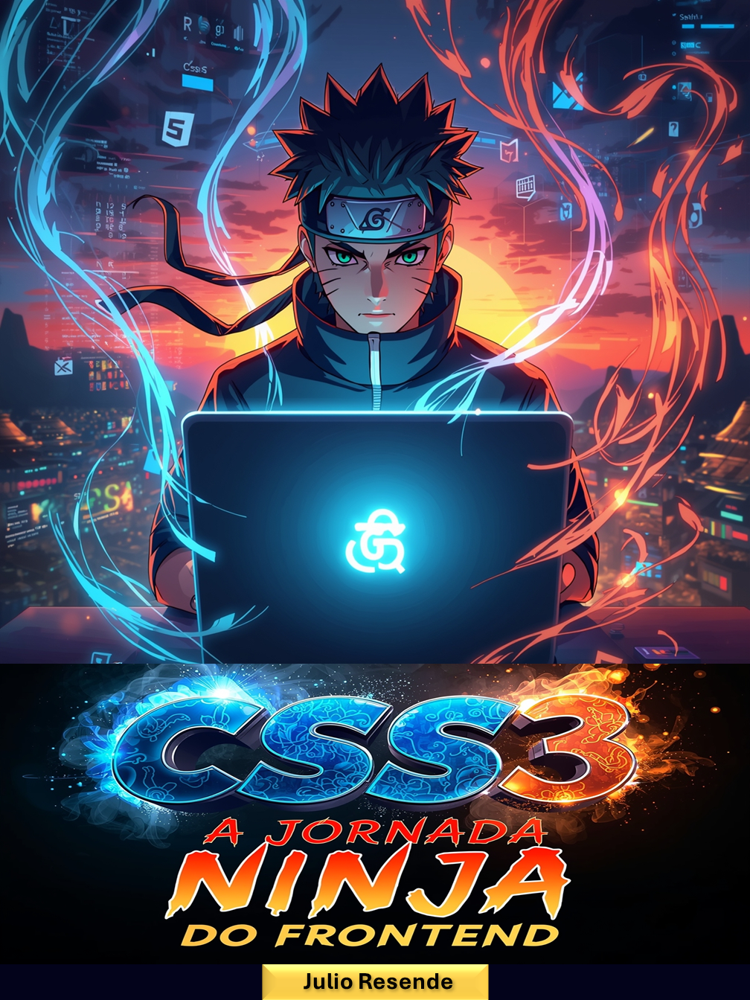

# 🥷 Ebook — **Seletores CSS Ninja**



## 🧭 Sobre o Ebook

O **Ebook Seletores CSS Ninja** foi criado com o objetivo de ensinar os **fundamentos do CSS3** de forma simples, clara e prática, com foco nos **principais seletores** utilizados no desenvolvimento frontend.

O conteúdo é voltado para **iniciantes na área de programação** que desejam aprender como aplicar estilos em páginas HTML de maneira eficiente e profissional.

Este material faz parte do projeto educacional de **Julio Resende**, desenvolvedor web e criador da RESTECH, com o propósito de compartilhar conhecimento e incentivar novos programadores a iniciarem suas jornadas na área de tecnologia.

---

## 📚 Estrutura do Ebook

O ebook está dividido em capítulos curtos e bem organizados, abordando os principais tipos de seletores CSS e suas aplicações.

### **Conteúdo Principal:**

1. **Introdução ao CSS3 e aos Seletores**
2. **Seletor de Elemento — O Básico**
3. **Seletor de Classe — Estilo Personalizado**
4. **Seletor de ID — O Golpe Único**
5. **Seletor Descendente — Hierarquia de Elementos**
6. **Seletor de Atributo — Foco em Detalhes**
7. **Seletor Universal — Aplicação Global**
8. **Pseudo-classes — Interação e Estados**
9. **Pseudo-elementos — Detalhes Específicos**
10. **Conclusão e Agradecimentos**

Cada capítulo contém **explicações diretas**, **exemplos de código reais** e **descrições práticas** que ajudam o leitor a entender rapidamente o funcionamento de cada seletor.

---

## ⚙️ Processo de Criação

O ebook foi desenvolvido como um experimento didático e criativo, unindo **conteúdo técnico** e **design acessível**.

### **Etapas da Produção:**

1. **🧠 Criação do Conteúdo**  
   O texto foi escrito com base nos conceitos fundamentais de CSS3, buscando clareza e objetividade para iniciantes.

2. **🤖 Assistência de Inteligência Artificial**  
   O conteúdo foi **gerado com auxílio de IA**, para estruturar e otimizar as explicações.  
   Posteriormente, o material foi **revisto e diagramado manualmente** por Julio Resende.

3. **🎨 Diagramação e Design**  
   A diagramação foi feita com foco em **legibilidade, simplicidade e fluidez visual**, resultando em um layout limpo e didático.  
   Foram utilizadas fontes modernas e espaçamento adequado para uma boa leitura em dispositivos móveis e desktop.

4. **📄 Exportação e Publicação**  
   O conteúdo final foi convertido e disponibilizado em formato **PDF**, pronto para download e leitura offline.

---

## 🧰 Ferramentas Utilizadas

- **Editor de Texto:** Visual Studio Code  
- **Formatação:** Markdown  
- **Conversão:** Pandoc / IA de formatação  
- **Design e Diagramação:** Ferramentas de edição de PDF  
- **Controle de Versão:** Git e GitHub  

---

## 📂 Estrutura do Repositório

```bash
└── ebook-seletores-css-ninja.pdf
├── 📄 README.md
└── 📔 capa-ebook.png
└── 📕 ebook-seletores-css-ninja.pdf    
```

## 👤 Autor

Julio Resende
Desenvolvedor Web Jr • Fundador da RESTECH
Apaixonado por tecnologia, desenvolvimento de sistemas e aprendizado contínuo, Julio tem como missão criar materiais acessíveis que facilitem a vida e os estudos de programação para iniciantes.

## 🧩 Objetivo do Projeto

Este projeto busca contribuir com a comunidade de desenvolvedores iniciantes, oferecendo um material educativo gratuito sobre CSS3 — uma das linguagens essenciais para o desenvolvimento web moderno.

O propósito é tornar o aprendizado mais prático, acessível e motivador para quem está dando os primeiros passos no frontend.

## 🧠 Aviso Importante

⚠️ Este ebook foi gerado parcialmente com auxílio de IA e revisado por humano.
O conteúdo tem fins didáticos e de demonstração, podendo conter pequenas variações ou simplificações conceituais.

## 🔗 Links

📄 Download do Ebook (PDF): 

💻 Repositório no GitHub: 

## 📜 Licença

Este projeto está sob a Licença MIT — você pode utilizá-lo, modificar e compartilhar livremente, desde que mantenha os créditos ao autor original.

## 💬 Contato e Redes

🌐 Site / Portfólio: 

💼 LinkedIn: 

📸 Instagram: 

💻 GitHub: 
